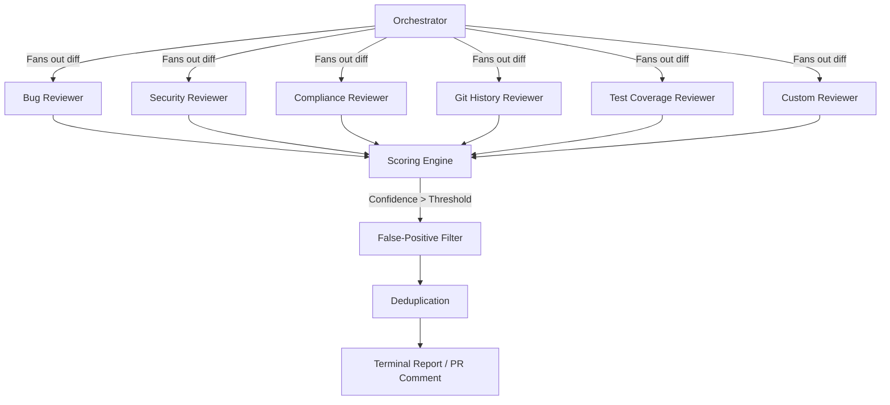

# reviewcrew

A Claude Code plugin marketplace. Currently ships one plugin:

## agentic-code-review

Multi-agent code review, the **agentic way**: one orchestrator command fans out to six parallel specialized reviewers — bugs, security, CLAUDE.md compliance, git history, test coverage — each with its own model and narrow mandate. Findings are scored 0–100 by confidence, filtered against a shared false-positive list, deduped, and reported to your terminal or posted as inline GitHub PR comments.

Extended re-implementation of Anthropic's official [code-review plugin](https://claude.com/plugins/code-review): same phase structure and confidence-gating philosophy, plus security + test-coverage reviewers and a local-diff mode that needs no GitHub.

Full docs: **[code-review-plugin/README.md](code-review-plugin/README.md)**

### Demo

> **Show, Don't Just Tell:** Watch the agents successfully review a complex PR and catch bugs standard linters miss.

 *(Add your demo GIF or video here)*

### Architecture



### Quickstart

Get up and running in under a minute via Claude Code.

**Prerequisites:** 
- Claude Code installed (`npm install -g @anthropic-ai/claude-code`)
- Ensure your environment has any required API keys configured.

```bash
/plugin marketplace add MANOJ21K/agentic-code-review
/plugin install agentic-code-review@reviewcrew
```

### Use

```bash
/agentic-code-review:code-review                 # review the local diff
/agentic-code-review:code-review 123             # review GitHub PR #123
/agentic-code-review:code-review 123 --comment   # post inline PR comments
/agentic-code-review:code-review --focus security --threshold 90
```

### Background & Credibility

This architecture is heavily informed by hands-on experience building complex platforms like **CoAgentics**. Developing real-world multi-agent systems—including insights gained as a finalist at the **Google Cloud Agentic AI Day hackathon**—shaped the orchestration, context passing, and confidence-gating logic of this tool. It is built to handle generative AI at scale, for developers who need reliable, low-noise code reviews.

### Contributing

We welcome contributions! Please see our [CONTRIBUTING.md](CONTRIBUTING.md) for details on how to get started. Look out for issues labeled `good first issue` or `help wanted` to jump right in.

### Layout

```
.claude-plugin/marketplace.json       marketplace manifest
code-review-plugin/
├─ .claude-plugin/plugin.json         plugin manifest
├─ commands/code-review.md            orchestrator (6-phase workflow)
├─ agents/                            7 reviewer subagents
├─ skills/                            confidence-scoring, review-reporting
└─ README.md                          full documentation
```
