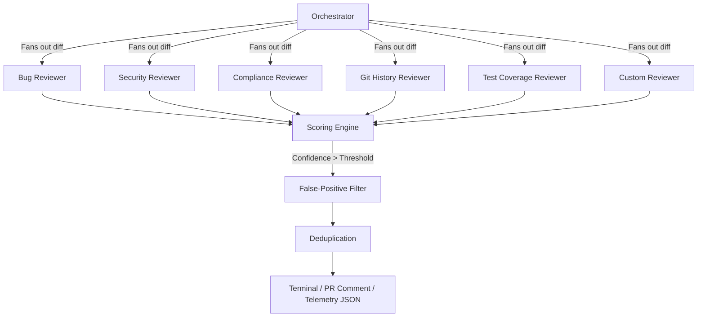

<div align="center">
  
# 🤖 ReviewCrew

**The Agentic Code Review Marketplace for Claude Code**

[](http://makeapullrequest.com)
[](https://opensource.org/licenses/MIT)
[](https://GitHub.com/MANOJ21K/agentic-code-review/graphs/commit-activity)
[]()

<p align="center">
  <em>Review your pull requests or local diffs the <strong>agentic way</strong>. One orchestrator command fans out to a crew of specialized subagents, aggressively filtering noise to deliver only high-signal, actionable feedback.</em>
</p>

</div>

---

## 📑 Table of Contents
- [Why ReviewCrew?](#-why-reviewcrew)
- [Key Features](#-key-features)
- [Show, Don't Tell](#-show-dont-tell)
- [Quickstart](#-quickstart)
- [Usage](#-usage)
- [Observability Dashboard](#-observability-dashboard)
- [Architecture](#-architecture)
- [Background & Credibility](#-background--credibility)
- [Roadmap](#-roadmap)
- [Contributing](#-contributing)
- [License](#-license)

---

## 🎯 Why ReviewCrew?

Instead of noisy, generic AI reviews that flag every minor styling nit, `agentic-code-review` acts like a senior engineer. It uses a **multi-agent orchestration model**. 

Each agent (Security, Bugs, Git History, etc.) runs in parallel with its own model and narrow mandate. Findings are scored 0–100 by confidence, filtered against a shared noise list, deduped, and reported to your terminal or posted as inline GitHub PR comments. 

> *Extended re-implementation of Anthropic's official [code-review plugin](https://claude.com/plugins/code-review): featuring the same phase structure and confidence-gating philosophy, plus **security** & **test-coverage** reviewers, a **local-diff mode**, and a **rich observability dashboard**.*

---

## ✨ Key Features

* **🚀 Parallel Fan-out:** Six specialized agents review your code simultaneously.
* **🛡️ Aggressive Noise Filtering:** A shared `confidence-scoring` rubric ensures you only see high-signal feedback.
* **💻 Local Diff Mode:** Review uncommitted changes right in your terminal—no GitHub required.
* **💬 GitHub Native:** Pass a PR number and `--comment` to automatically post deduped, inline review comments.
* **📊 Observability Dashboard:** Launch a beautiful local web UI to inspect the exact findings and confidence scores of every agent.

---

## 🎬 Show, Don't Tell

Watch the agents successfully review a complex PR, catch bugs standard linters miss, and filter out the noise.

<div align="center">
  
  <p><em>(To be added)</em></p>
</div>

---

## 🚀 Quickstart

Get up and running in under a minute via Claude Code.

**Prerequisites:** 
- [Claude Code](https://docs.anthropic.com/en/docs/agents-and-tools/claude-code/overview) installed (`npm install -g @anthropic-ai/claude-code`)
- Ensure your environment has the required Anthropic API keys configured.

```bash
# 1. Add the marketplace
/plugin marketplace add MANOJ21K/agentic-code-review

# 2. Install the plugin
/plugin install agentic-code-review@reviewcrew
```

---

## 💻 Usage

Run reviews directly from your Claude Code terminal. 

```bash
# Review your uncommitted local diff
/agentic-code-review:code-review                 

# Review GitHub PR #123 (Terminal report only)
/agentic-code-review:code-review 123             

# Review GitHub PR #123 & post inline PR comments
/agentic-code-review:code-review 123 --comment   

# Strict scan: Only run the security agent with a high confidence threshold
/agentic-code-review:code-review --focus security --threshold 90 
```

---

## 📊 Observability Dashboard

Multi-agent systems shouldn't be a black box. Visualize exactly how the agents performed, what they found, and why the orchestrator filtered certain items out.

After running a code review, launch the dashboard:

```bash
/agentic-code-review:dashboard
```

*This spins up a local server and opens a sleek, glassmorphic UI in your browser displaying the full telemetry of the run.*

---

## 🏗️ Architecture



---

## 🧠 Background & Credibility

This architecture is heavily informed by hands-on experience building complex platforms like **CoAgentics**. Developing real-world multi-agent systems—including insights gained as a finalist at the **Google Cloud Agentic AI Day hackathon**—shaped the orchestration, context passing, and confidence-gating logic of this tool. It is built to handle generative AI at scale, tailored for senior developers who demand reliable, low-noise code reviews.

---

## 🗺️ Roadmap

- [x] Initial release with 6 specialized agents
- [x] Observability UI and telemetry logging
- [ ] Support for custom, user-defined agent injection
- [ ] Integration with CI/CD pipelines (GitHub Actions)

---

## 🤝 Contributing

We welcome contributions! Please see our [CONTRIBUTING.md](CONTRIBUTING.md) for details on how to get started. 

Look out for issues labeled `good first issue` or `help wanted` to jump right in. High-impact areas include adding support for new languages, optimizing agent prompts, and enhancing the observability dashboard.

---

## 📜 License

This project is licensed under the [MIT License](https://opensource.org/licenses/MIT).

---

### 📁 Layout

```text
.claude-plugin/marketplace.json       marketplace manifest
code-review-plugin/
├─ .claude-plugin/plugin.json         plugin manifest
├─ commands/                          orchestrator & dashboard launchers
├─ dashboard/                         observability UI source (HTML/CSS/JS)
├─ agents/                            7 reviewer subagents
├─ skills/                            confidence-scoring, review-reporting
└─ README.md                          full documentation
```
